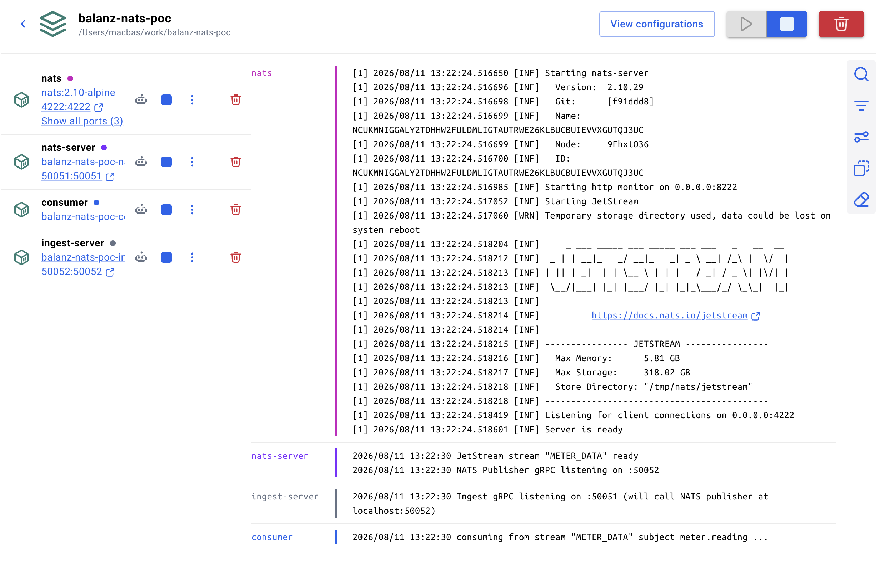
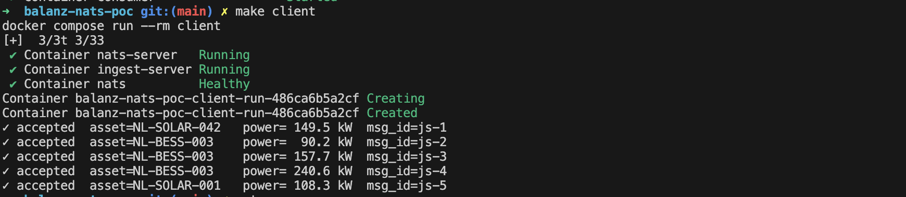

# Balanz Energy – NATS JetStream PoC (gRPC + Buf monorepo)


https://grok.com/share/bGVnYWN5_b3e05113-1be7-432d-830d-e77aede50e1d

Proof-of-concept that demonstrates the **NATS / JetStream** path for real-time meter data, structured the way this tutorial lays out: 
[Hands-on Buf Monorepo for Go gRPC: A Multi‑Module Protobuf Architecture](https://medium.com/@cassius.paim/hands-on-buf-monorepo-for-go-grpc-a-multi-module-protobuf-architecture-2fd47d16b6a2)

## Architecture

```
┌─────────────┐     gRPC      ┌──────────────────┐     gRPC      ┌─────────────────────┐
│   Client    │ ────────────► │  IngestService   │ ────────────► │ NatsPublisherService│
│ (cmd/client)│               │ (cmd/ingest-…)   │               │ (cmd/nats-server)   │
└─────────────┘               └──────────────────┘               └──────────┬──────────┘
                                                                             │
                                                                             │ JetStream
                                                                             ▼
                                                                   ┌─────────────────┐
                                                                   │  NATS Server    │
                                                                   │  stream:        │
                                                                   │  METER_DATA     │
                                                                   └────────┬────────┘
                                                                            │
                                                                            ▼
                                                                   ┌─────────────────┐
                                                                   │  Consumer       │
                                                                   │  (cmd/consumer) │
                                                                   └─────────────────┘
```

- **IngestService** – entry point that accepts `MeterReading` messages (asset-level power/energy data).
- **NatsPublisherService** – owns the NATS connection and publishes to JetStream. Kept separate so the ingest path stays thin and the messaging layer can scale / evolve independently (exactly the pattern you want for a trading / forecasting pipeline).
- **Consumer** – durable JetStream consumer that prints the readings (stands in for downstream forecasting / trading workers).

## Protobuf layout (Buf v2 workspace)

```
proto/
├── common/v1/error.proto
├── meter/v1/
│   ├── meter.proto
│   └── ingest_service.proto
└── nats/v1/
    └── publisher_service.proto
```

Generated stubs land in `gen/`.

## Quick start

### Prerequisites
- Go 1.22+
- Buf CLI (`curl -sSL https://github.com/bufbuild/buf/releases/download/v1.47.2/buf-Linux-x86_64 -o /tmp/buf && chmod +x /tmp/buf`)
- NATS Server with JetStream (`nats-server -js`)

### Generate & build
```bash
make generate
```

### Run
```bash
make up
```



You should see the client print accepted readings and the consumer print the corresponding JetStream messages with sequence numbers.



## Why this shape is useful for Balanz

- Real-time meter data arrives via gRPC (or later via MQTT/HTTP adapters that call the same IngestService).
- Publishing is isolated behind its own gRPC service → easy to add retries, circuit-breaking, batching, or switch to a different broker later.
- JetStream gives durable, ordered, replayable streams – perfect for feeding forecasting models and automated trading logic.
- Buf multi-module layout keeps domain contracts clean and independently versionable (common types, meter domain, messaging domain).

## Next steps you can show in the interview
- Add a second consumer that does simple aggregation / forecasting.
- Switch the payload to pure protobuf bytes instead of JSON.
- Add OpenTelemetry tracing across the two gRPC hops + NATS.
- Use NATS subject hierarchy (`meter.reading.<asset_id>`) for per-asset routing.
